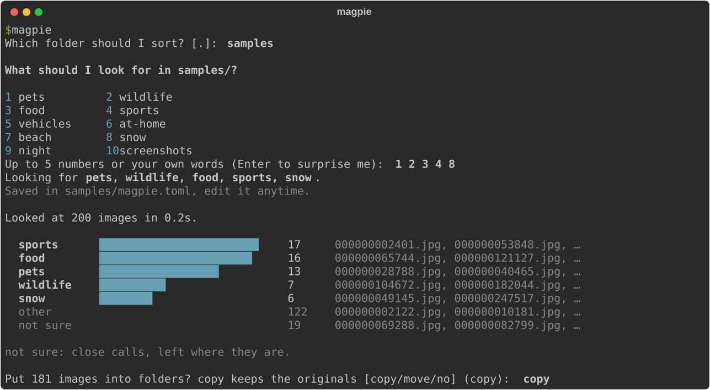

<p align="center">
  
</p>

<h1 align="center">magpie</h1>

<p align="center">
  <b>Sort a folder of photos into your own categories.</b><br>
  Private, fast, and it never touches a file without asking.
</p>

<p align="center">
  
  
  
</p>

<p align="center">
  
</p>

## Install

```bash
uv tool install git+https://github.com/felipemagr/magpie
```

## Use

```bash
magpie
```

That's it. magpie asks which folder, what to look for, and whether to copy or move the photos into
`magpie-output/<category>/`. Changed your mind? `magpie undo <folder>` puts everything back.

## Why magpie

- **Private.** Your photos never leave your computer. No account, no cloud, works offline.
- **Fast.** About 30 ms per photo on a laptop CPU. Re-runs are near instant.
- **Safe.** Nothing moves until you say so. Nothing is ever overwritten. Every sort can be undone.
- **Yours.** Pick from ready-made categories or just type your own words: `tickets`, `whiteboards`,
  `my-dog`.

## Try it on sample photos

```bash
git clone https://github.com/felipemagr/magpie && cd magpie
make samples   # 200 random everyday photos from COCO
magpie         # answer: samples
```

<details>
<summary><b>All commands</b></summary>

| Command | What it does |
|---|---|
| `magpie` | Guided: pick a folder, set up, sort, copy or move |
| `magpie init <folder>` | Choose categories (saved in `magpie.toml`) |
| `magpie run <folder>` | Sort and show the summary, touch nothing |
| `magpie show <folder> [--category X]` | Every photo with its category and confidence |
| `magpie apply <folder> --mode copy\|move\|symlink [--yes]` | Place photos, dry run without `--yes` |
| `magpie undo <folder>` | Revert the last sort |

Global options: `--threshold 0.6` (how sure before sorting), `--device cpu|cuda|mps`.

</details>

<details>
<summary><b>How it works</b></summary>

magpie compares each photo with your category descriptions using
[SigLIP 2](https://huggingface.co/google/siglip2-base-patch16-224), an open image-text model that
runs on your machine. Photos that match nothing go to `other`; close calls stay where they are.
Details in [`docs/spec.md`](docs/spec.md).

</details>

## Contributing

```bash
make install   # dependencies
make ci        # lint and tests
```

MIT licensed.
